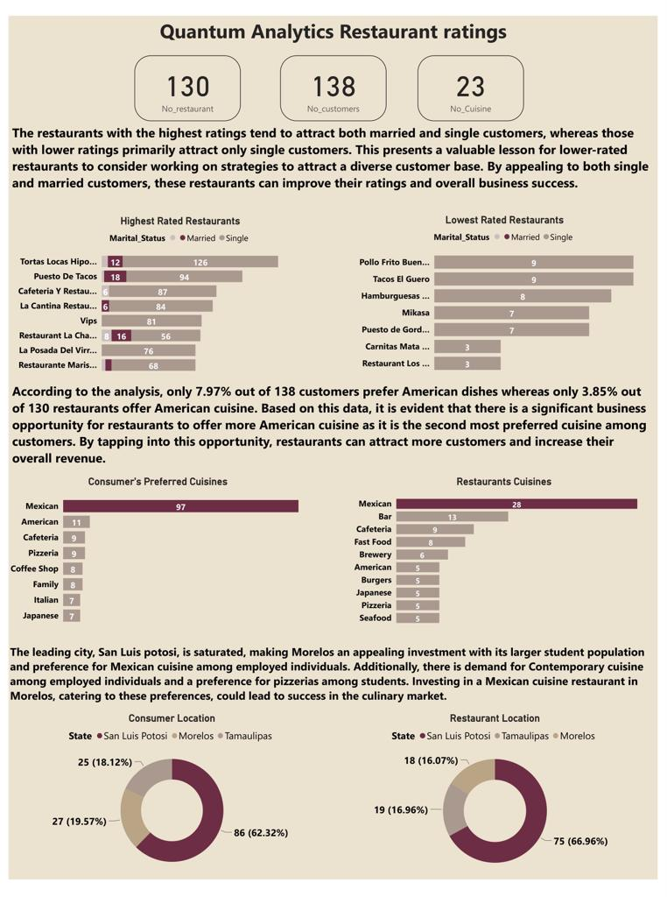

# Quantum-Analysis-Restaurants-Rating-Analysis
# Introduction
This is my submission for the Quantum Analysis Assignment.The project involve conducting a research on various restaurants, thier cusomers, cuisnises offeres location. To identify top rated restaurants, and also identify business opportunities. 
There are four data for available for the analysis which invloes the information of Ratings,consummer(thier location, occupation, age, marital status), restaurant cuisines offeres, consumer's preferred cusinies.

# Business Question
1. What can you learn from the highest rated restaurants? Do consumer preferences have an
effect on ratings?
2. What are the consumer demographics? Does this indicate a bias in the data sample?
3. Are there any demand & supply gaps that you can exploit in the market?
4. If you were to invest in a restaurant, which characteristics would you be looking for?

# Dashboard

